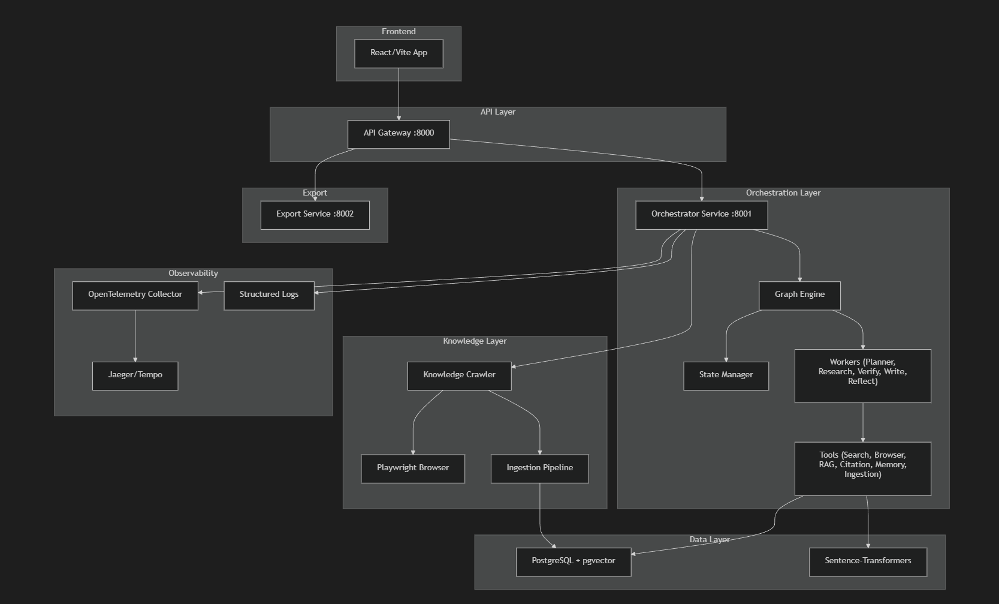

# ARS — Autonomous Research System 🧠🔬

> **Status:** 🚧 **Experimental / Learning Project**  
> *This is an experimental research project started purely for learning purposes. It is not intended for production use. Much of the codebase was generated by AI agents (coding assistants) to explore advanced microservices, DAG orchestration, and autonomous LLM behaviors.*

ARS is an experimental, massively parallel, graph-orchestrated research platform. It was designed to explore how autonomous AI agents can continuously crawl academic databases (like arXiv), inject findings into a localized `pgvector` knowledge base, and orchestrate complex research reports via a DAG (Directed Acyclic Graph) engine.

## 🏗️ Architecture 



This platform uses a microservices architecture to separate the LLM orchestration heavy lifting from the API Gateway and frontend layers.

```text
ARS/
├── frontend/               # React-based UI for monitoring research tasks
└── backend/
    ├── api-gateway/        # HTTP Proxy — routes frontend to orchestrator
    ├── orchestrator-service/ # Core DAG engine, autonomous crawlers, tools
    ├── export-service/     # DOCX/PDF report generation
    └── docker-compose.yml  # Full stack: PostgreSQL (pgvector), Jaeger, services
```

## ✨ Core Features (So far)
- **DAG Execution Engine**: Schedules parallel AI worker tasks (Planner → N×Researcher → Verifier → Writer).
- **Autonomous arXiv Crawler**: An independent, LLM-driven browser agent that continuously crawls, reads, and ingests academic papers into the database without human intervention.
- **State Management**: PostgreSQL-backed task state with optimistic locking to prevent race conditions during parallel worker execution.
- **Recovery & DLQ**: Checkpointing and dead letter queues for failed tasks to ensure fault tolerance.
- **Observability**: Structured JSON logging and OpenTelemetry tracing routed to Jaeger UI.

---

## 🎥 Video Demo
Check out the ARS platform in action! Watch the full video demonstration showing the autonomous agent workflow, orchestration, and crawling process on LinkedIn:
**[Watch the Demo Video Here](https://www.linkedin.com/posts/rishon-madathimannil-mathew_ai-llm-aiagents-activity-7457753875907969024-_D0Q?utm_source=share&utm_medium=member_desktop&rcm=ACoAADYGqp0BR6J-3Kn-hCYcSjmV_ry2_dE5WgU)**

---

To run the full backend stack (including PostgreSQL, Jaeger, and the Python microservices) via Docker:

```bash
cd backend
cp .env.example .env
# Edit .env to add your GEMINI_API_KEY or OPENAI_API_KEY
docker compose up --build
```

### Services Map
| Service | Port | Purpose |
|---------|------|---------|
| API Gateway | 8000 | Frontend-facing proxy |
| Orchestrator | 8001 | Graph engine, workers, knowledge |
| Export | 8002 | Report export (DOCX/PDF) |
| PostgreSQL | 5432 | State, knowledge base (pgvector) |
| Jaeger UI | 16686 | Distributed tracing |

## 🗺️ Roadmap (Upcoming)
- [ ] Stabilizing the frontend React dashboard connection to the API Gateway.
- [ ] Optimizing the autonomous arXiv crawler's search heuristics to prevent semantic drift.
- [ ] Expanding LLM support for local models (e.g., Llama via Ollama).
- [ ] Finalizing the `export-service` DOCX templates.

## 🤝 Contributing
Because this is an active WIP, contributions are highly encouraged! Feel free to open issues discussing architectural improvements, DAG scheduling optimizations, or crawler heuristics.

## 📝 License
This project is open-source and available under the [MIT License](LICENSE).
